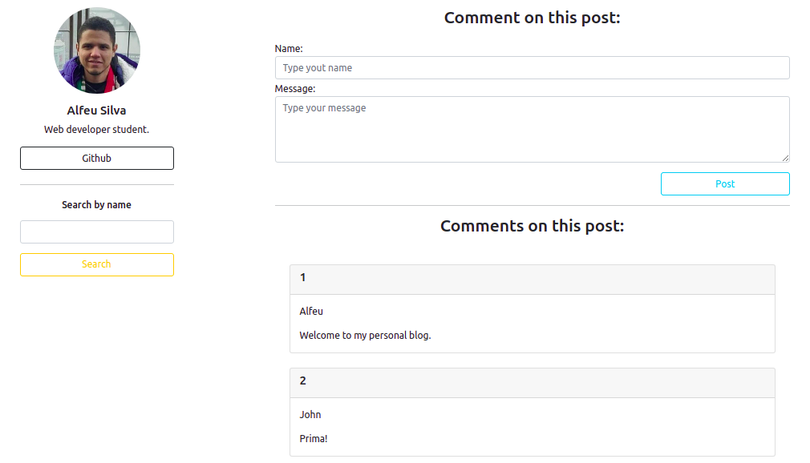
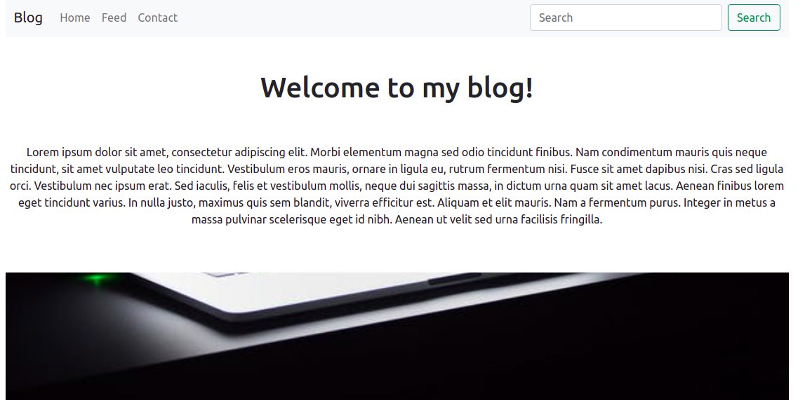
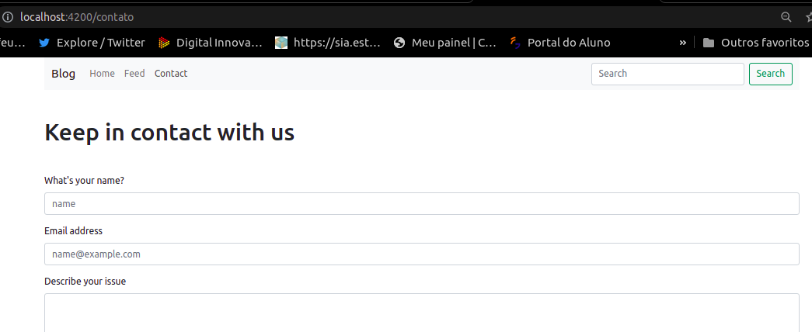
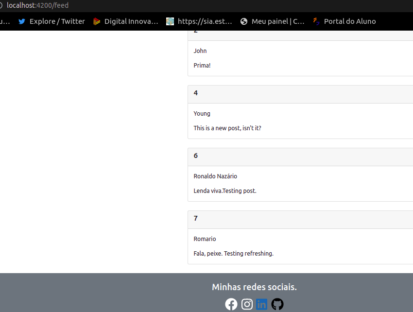

# Creating a personal Blog using Angular and Java
<p>In this project was taught create and linking front + backend. The backend side was created using a json file whereas frontend was created using javascript, css, html, ts and angular.<p><br/>

## The tools used to create this project are listed below:

<li>Visual Studio Code;

<li>Node.js;

<p><li>Angular:</p>

<p>Once in the project's repository, run the command:</p>

```npm -g @angular/cli```
<p>To create a new project called 'blog':</p>

```ng new blog```

<p>To go to the blog's folder where angular is kept:</p>

```cd blog```

<p>And then run the command below to start the serve:</p>

```ng serve -o```

<p><li>JSON server:</p>

```npm init -y```

```npm i json-server```

```npm start```

<p><li>Installing bootstrap and @jquery:</p>

```npm i bootstrap``` -> Used to create style

```npm i jquery@~3.4.1``` -> Used on angular

```npm i popper.js``` -> Used on angular

```ng add @fortawesome/angular-fontawesome``` -> Angular's package

## Project's images:





